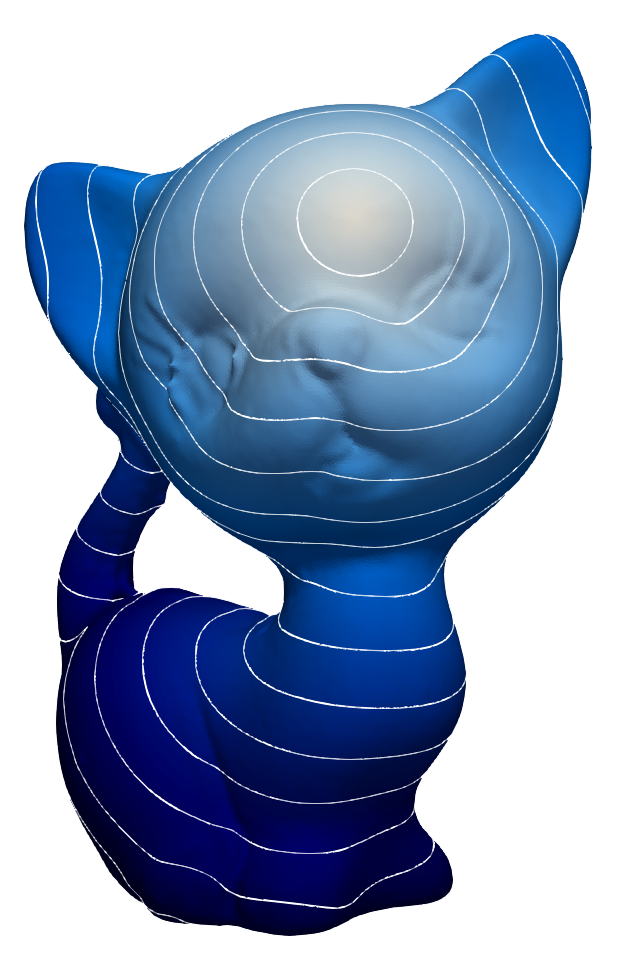

# 測地距離の計算

  

三角形メッシュの測地距離の計算手法を実装
### 概略
`make_cotan_laplacian()`でcotan重みラプラシアンL_cotanを作る．
`make_mass_matrix()`で質量行列Aを作る．
`get_time()`でパラメータ`time`の値を得る．
ラプラシアンの線形システムを解いて熱流関数uを計算する．

`get_gradient()`でuの勾配∇uを計算する．
`get_divergence()`でベクトル場Xの発散∇・Xを計算する．

ラプラシアンの線形システムを解いて測地距離を計算する．

### サンプル出力の情報
ソースとなる頂点を頂点7000とした結果．
- 入力メッシュ : `294_kitten_uniform.obj` （頂点数 134,448 面数 268,896）
- 出力：`kitten_uniform_geodesic.vtk`
- 実行時間 : 2.72206 秒
